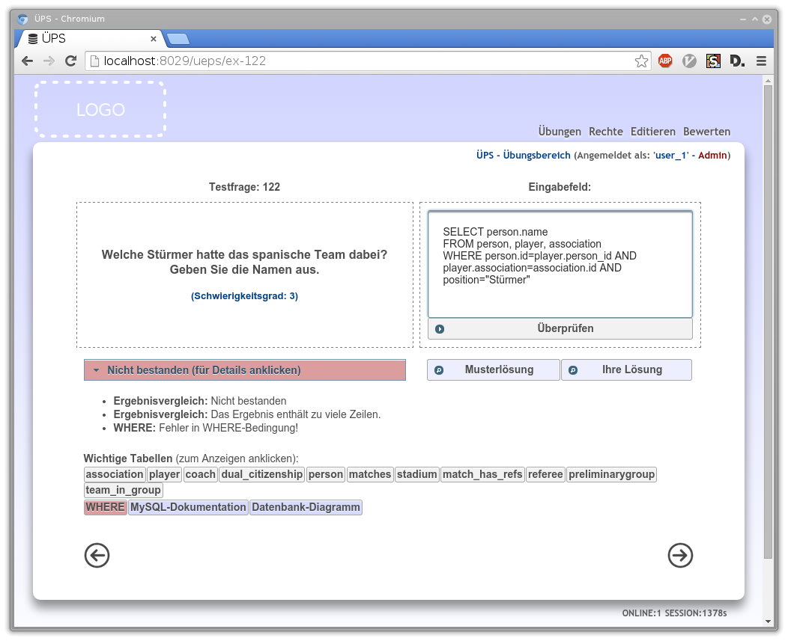
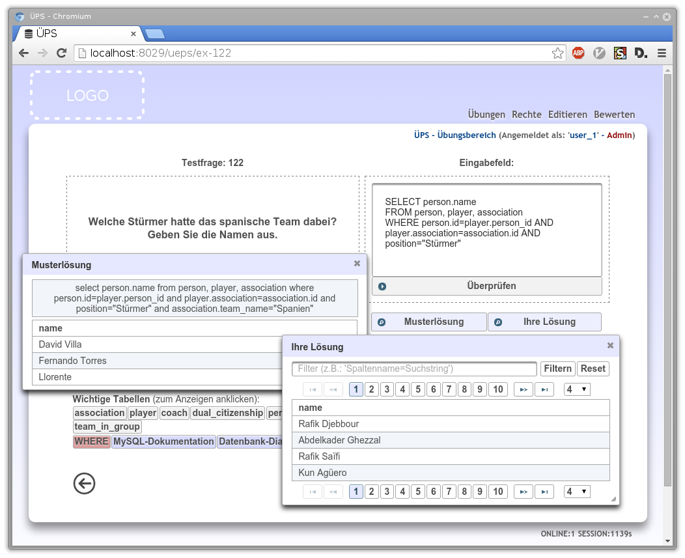

# ÜPS
**ÜPS** (**Ü**bungs-**P**rogramm für **S**QL) ist ein webbasiertes Trainingssystem zum Erlernen der Datenbanksprache SQL.

## Kurzanleitung zur Installation

``git clone --depth=1 https://github.com/UniversityOfWuerzburg-ChairCompSciVI/ueps``

TODO :: TODO :: TODO :: TODO

## Systemanforderungen
* Tomcat 7 oder höher
* Maven (zum Kompilieren)
* MySQL

## Konfiguration und Deploy
TODO :: TODO :: TODO :: TODO

### Dokumentation
<!--- TODO: -->
[Doxygen Dokumentation](http://kolbasa.github.io/ueps/doxygen/)

## Neues Szenario erstellen
TODO :: TODO :: TODO :: TODO

### Aufgabengruppe erstellen
TODO :: TODO :: TODO :: TODO

### Aufgabe erstellen
TODO :: TODO :: TODO :: TODO

## Benutzerrechte hinzufügen/bearbeiten
TODO :: TODO :: TODO :: TODO
### Rolle 'Admin'
TODO :: TODO :: TODO :: TODO
### Rolle 'Dozent'
TODO :: TODO :: TODO :: TODO

## Abgaben bewerten
TODO :: TODO :: TODO :: TODO

## Screenshots
