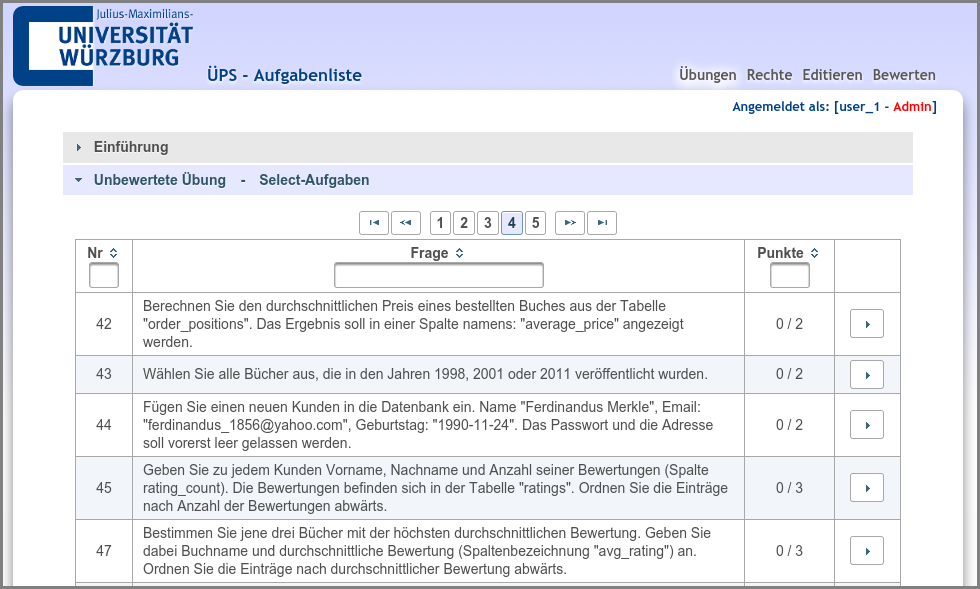
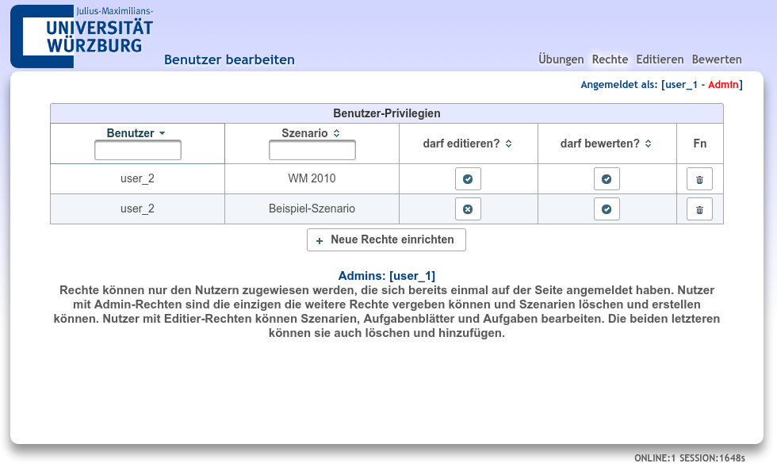
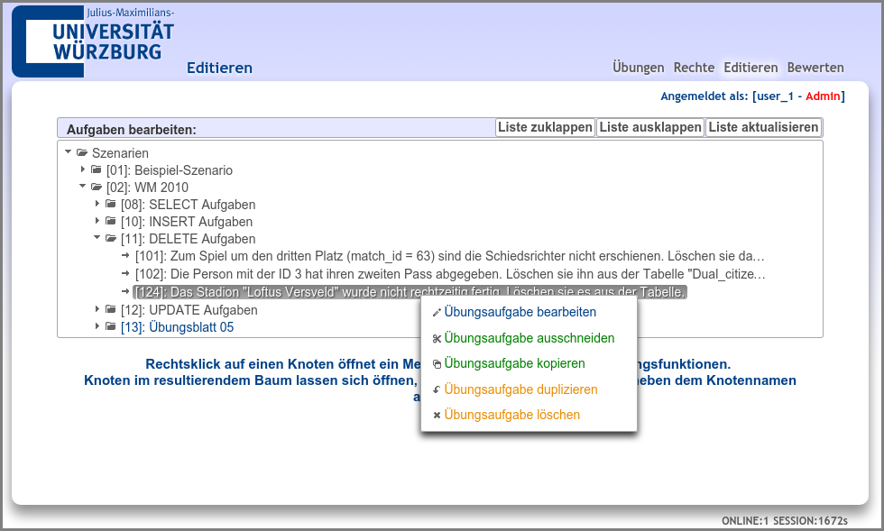
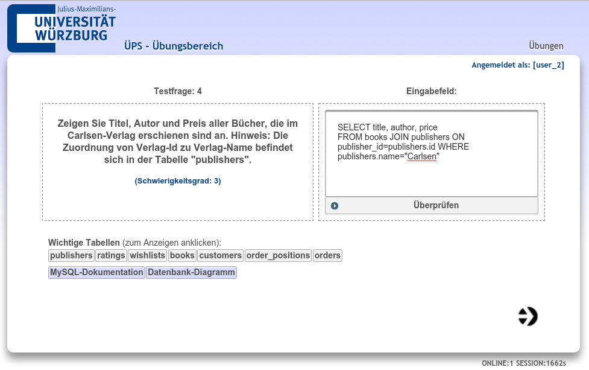
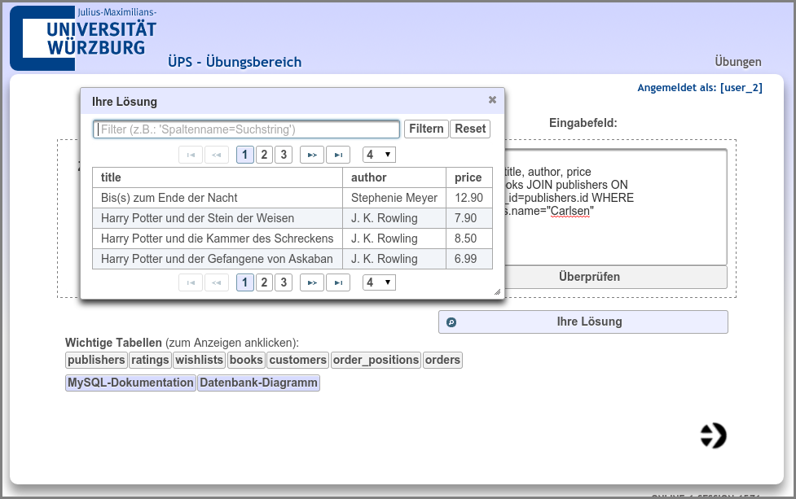
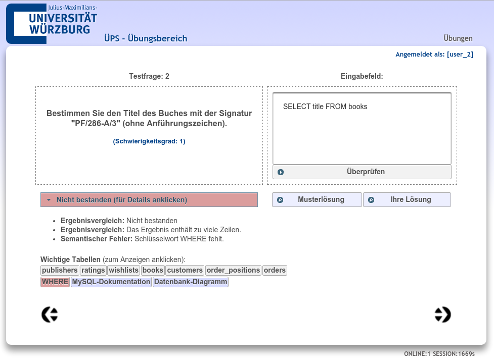
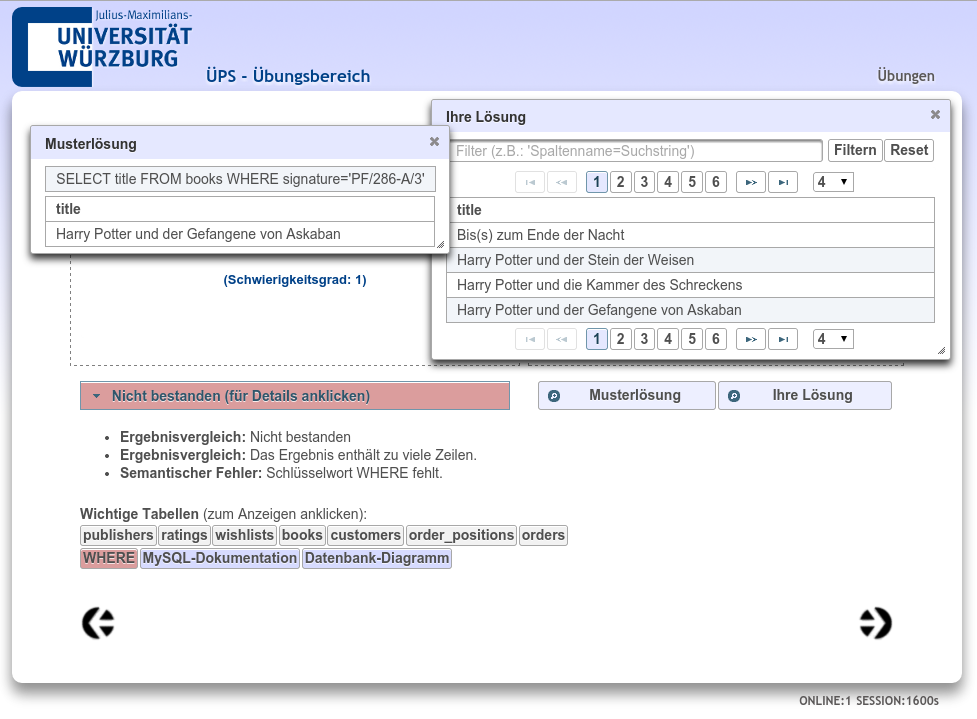
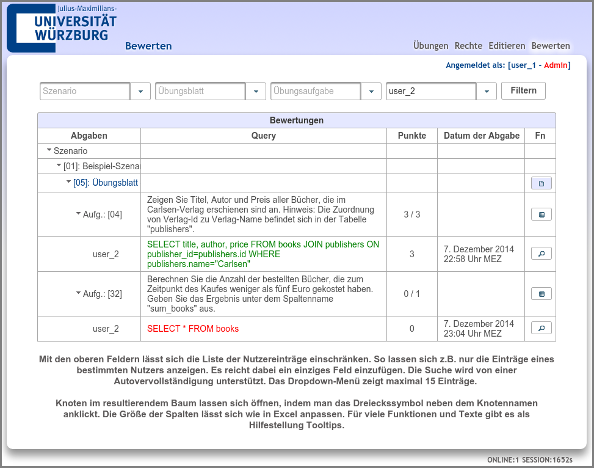
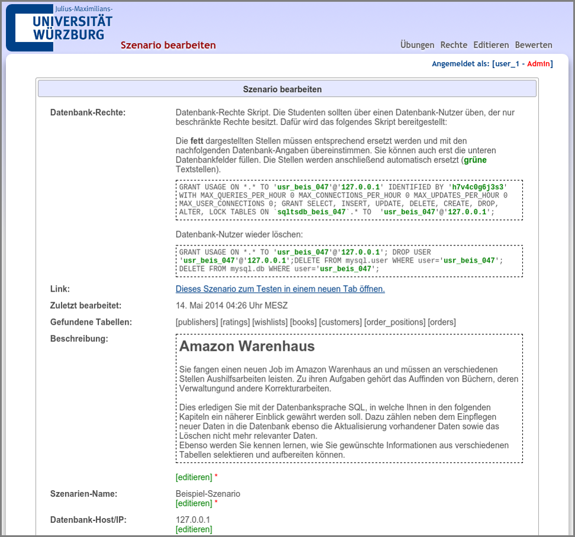

# ÜPS
ÜPS (Übungs-Programm für SQL) is a web-based intelligent teaching tool for the SQL database language.

## Quick Install Guide

### Requirements
Testing 1

### Download and Install
Testing 2

### Configuration
Testing 3

## Administration
Testing 4

### Assigning permissions
Testing 5

### Editing scenarios
Testing 6

### Review student solutions
Testing 7

## Build from source
Testing 8
